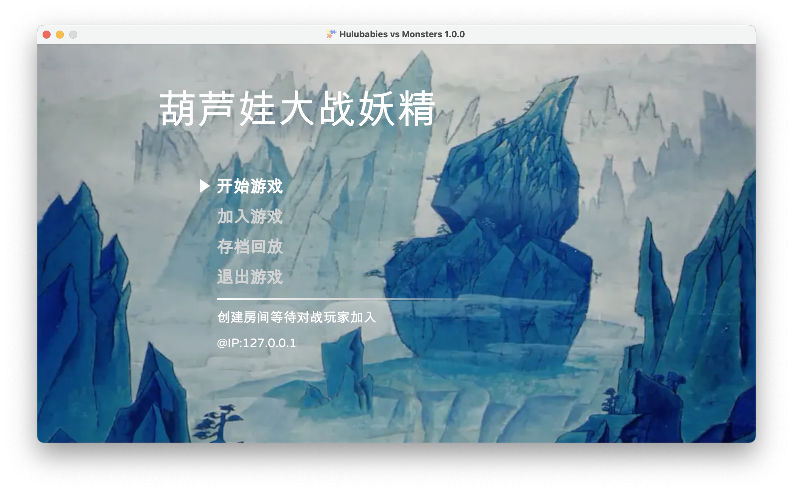
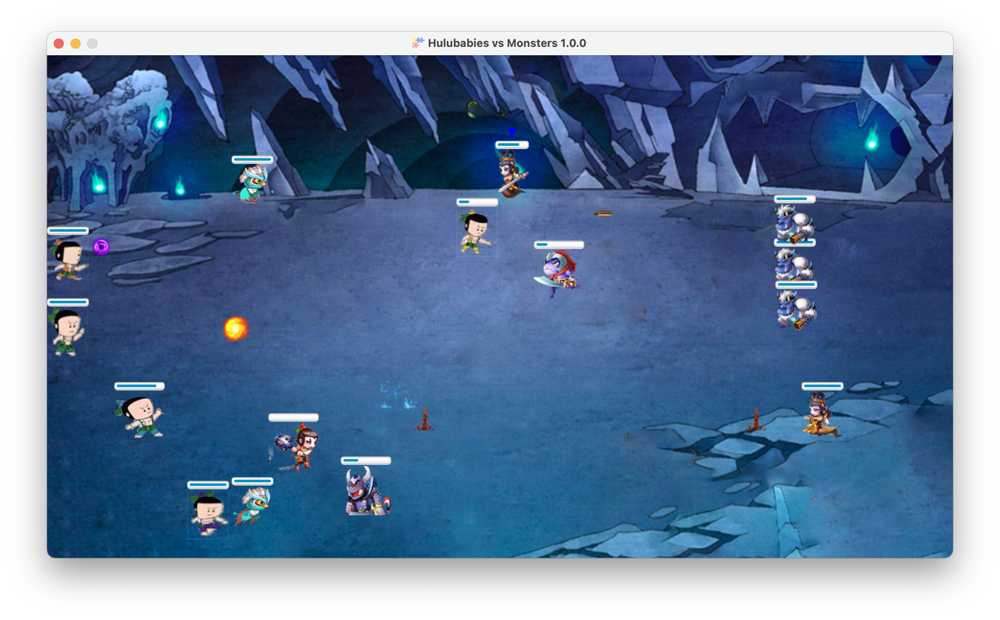
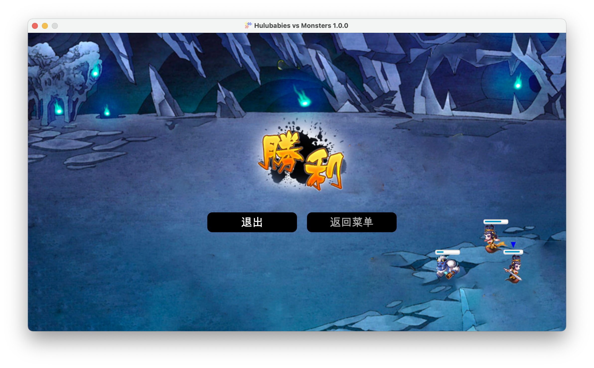

# 葫芦娃大战妖精
南京大学 2020 秋季学期高级 Java 程序设计大作业.

作业基于[JavaFX](https://openjfx.io/)图形化框架, [FXGL](https://github.com/AlmasB/FXGL)游戏框架实现.


## 编译与运行说明

本项目的所有运行实例均在OpenJDK 15.0环境下完成.

编译生成jar包命令: 

```bash
mvn clean test package
```

在`target`目录下会生成`hulubaby-vs-monster-1.0.jar`和`hulubaby-vs-monster-1.0-jar-with-dependencies.jar`两个jar包, 后者不需要其他第三方jar包即可单独运行:

```bash
java -jar target/hulubaby-vs-monster-1.0-jar-with-dependencies.jar
```

**关于部分功能**:

由于Mac文件系统的权限问题, 本游戏在macOS系统下部分与I/O相关的功能可能出现异常, 如导入和加载录像等. 在Windows系统下功能正常.


## 游戏截图

游戏菜单主界面:



游戏中画面:



游戏结束界面:



录像回放演示:


## 游戏游玩说明

### 游戏控制

- 鼠标左键: 选择控制单位, 控制单位必须是己方阵营
- 方向键: 控制当前选择人物移动
- A键: 人物攻击

### 录像和回放

在开始游戏后按下空格即可进行录制，录制过程中右上角会出现录制中的字样和红点闪烁，再次按下就会暂停录制，在游戏分出胜负之后会自动检测是否进行了存档.

如果有存档则弹出询问是否保存，保存可填写存档名.

在主菜单有存档回放按钮，点击进去可以查看目前的存档，点击后进行加载，还可以对存档进行管理，导入或删除，导入的存档需满足命名规则（以`_hulu_recordVideo.zip`结尾）

进入回放界面可以使用空格进行回放的暂停与否，左右键来控制后退和快进.


## 最新更新

### 1.0.0 (2021-01-04)

让游戏菜单主界面图片同窗口大小相符.

增加了更多游戏角色, 调整了平衡性. 阵营双方实力大致平衡.

修复多个导致游戏异常的bug.

### 0.5.0 (2021-01-04)

整合了两版代码.

### 0.4.0 (2021-01-04)

添加葫芦娃系列的更多角色.

### 0.3.4 (2021-01-03)
更新了存档文件夹为空会出错的bug

更新UI逻辑，见下文详细文档描述.

### 0.3.3 (2021-01-03)
添加了回放的进度条，暂停、快进和回退功能

添加了播放结束后的UI


### 0.3.2 (2021-01-02)
添加了游戏结束判断机制，以及游戏结束后的UI

### 0.3.1 (2021-01-01)
修复存档录像人物被杀死后不移除的bug

### 0.3.0 (2021-01-01)
完成了存档以及回放功能并融合进游戏模块

- 存档可设置名字
- 存档可进行管理，删除或添加

存档按照帧来存，一秒60帧，存下所有的实体以及变量信息

加载的时候按帧设置实体信息

TODO:

- 回放的进度条
- 回放时的功能限制
- 游戏结束的界面

### 0.2.1 (2021-01-01)

修正了一个联机游玩时, 单位死亡会导致游戏退出的恶性bug.

### 0.2.0 (2020-12-31)

设计了AI模块与近战攻击模块, 重新手写了碰撞检测逻辑, 加入了一个葫芦娃素材用作近战攻击测试.

存在bug: 

- 两个AI互相贴近时可能会卡死.

### 0.1.1 (2020-12-27)

网络通信模块已经完全融入Demo, 当前演示情况: 

- 在Server端按空格开始游戏, 不需要Client上再按. (Server会自动选择Client端的默认控制单位并在按下空格时发给Client)
- 当前Demo是一个2v2的战场, 左右两边为两个阵营. 按鼠标左键选择控制单位 (TODO: 控制单位的选择暂时还没有按阵营限制)
- Client端选择控制人物在本地进行, 剩余操作除了移动操作会进行预渲染外, 其他操作 (如攻击) 通过Server执行.
- 碰撞事件 (如弹道伤害结算) 在Serve端处理. (TODO: 将时间处理函数从Main函数中移出去, 封装为若干个类)

添加动作输入的方法 (备忘) : 

- `initInput`中绑定到热键.
- 创建`UserAction`类
- 在对应的执行方法中添加Server和Client两种情况下的处理 (Client端需要发消息给Server)
- 在`MultiplayerConnectionService`中添加Serve对该消息的处理

### 0.4.0 (2021-01-04)

添加葫芦娃系列的更多角色.

### 0.2.1 (2021-01-01)

修正了一个联机游玩时, 单位死亡会导致游戏退出的恶性bug.

### 0.2.0 (2020-12-31)

设计了AI模块与近战攻击模块, 重新手写了碰撞检测逻辑, 加入了一个葫芦娃素材用作近战攻击测试.

存在bug: 

- 两个AI互相贴近时可能会卡死.

### 0.1.1 (2020-12-27)

网络通信模块已经完全融入Demo, 当前演示情况: 

- 在Server端按空格开始游戏, 不需要Client上再按. (Server会自动选择Client端的默认控制单位并在按下空格时发给Client)
- 当前Demo是一个2v2的战场, 左右两边为两个阵营. 按鼠标左键选择控制单位 (TODO: 控制单位的选择暂时还没有按阵营限制)
- Client端选择控制人物在本地进行, 剩余操作除了移动操作会进行预渲染外, 其他操作 (如攻击) 通过Server执行.
- 碰撞事件 (如弹道伤害结算) 在Serve端处理. (TODO: 将时间处理函数从Main函数中移出去, 封装为若干个类)

添加动作输入的方法 (备忘) : 

- `initInput`中绑定到热键.
- 创建`UserAction`类
- 在对应的执行方法中添加Server和Client两种情况下的处理 (Client端需要发消息给Server)
- 在`MultiplayerConnectionService`中添加Serve对该消息的处理

### 0.1.0 (2020-12-26)

添加网络通信与多人对战模块. 存在bug:

- 暂时只能使用移动功能, 攻击功能还在修改.

### 0.0.2

改写了部分代码, 修正了几个bug: 

- 将`BulletComponent`作为单独组件, 与`MovableComponent`分开.
- 修正了`ControllableComponent`的逻辑, 在单位进行攻击时无法控制单位转向.
- 修改了`OperableComponent`组件中`enable`和`disable`的逻辑, 调用一次函数可以禁用该角色的所有`OperableComponent`子类型组件.
- 修正了鼠标单击选择可以选中弹道的bug.

目前发现的bug:

- 角色转向时血条会跟随角色一起反转, 还没想到解决方案.

### 0.0.1

提交了第一版Demo


## 游戏应用程序

`Main`类中为游戏`GameApplication`主引擎, 通过`main`函数启动游戏. 启动时初始化以下部分: 

- 初始化游戏设置. 包括画面宽高, 游戏名和版本号等信息.
- 初始化游戏. 创建初始游戏角色, 加载视图与环境.
- 初始化输入. 通过方向键控制当前操作角色移动, A键进行攻击, 鼠标左键单击切换操作角色.
- 初始化物理引擎. 处理角色间的碰撞事件 (任两个角色位置不能重叠), 弹道和角色的碰撞事件.


## 单位仓库 `HvMFactory`

通过单位仓库, 实现不同单位的产生逻辑.

通过`broadcastSpawnEvent`函数, 将单位产生事件广播到client端.


## 组件

通过实现不同的组件, 反映创建出单位的不同能力.

### 基础组件 (所有单位都具备)

#### OperableComponent

基本动作组件, 包含属性 `isOperable`, 当其为`true`时可对单位进行更新. 

#### DetailedTypeComponent

基本类型组件, 包含该单位的详细类型 (`enum`) 与所属阵营 (`enum`)


### 移动组件

#### MovableComponent

继承自OperableComponent

具有X, Y轴上的速度属性, 每帧对该单位的所处位置进行更新. 

不能进行控制的可移动单位拥有该组件. (如弹道轨迹)

#### ControllableComponent

继承自 MovableComponent

可进行移动控制的组件,  包含 moveUp/moveDown/moveLeft/moveRight/stop/... 等控制函数, move\*函数中设置对应轴的速度为maxSpeed, stop\*函数中将速度赋值为0. 

可以进行控制 **(或可以被AI控制)** 的角色拥有该组件.


### 攻击组件

#### AttackComponent

继承自OperableComponent

可攻击组件, 需要提供属性

- `attackAnimationTime`: 攻击前的等待时间.
- `attackBackSwingTime`: 攻击后的等待时间.
- `damage`: 攻击伤害

发出攻击指令后, 会将`isOperable`置为`false`, 在等待时间内其他的移动与攻击操作均无效. 

该组件本身不会产生任何攻击效果! 需要通过下面两个组件实现.

#### RangedAttackComponent

继承自AttackComponent

远程攻击组件, 需要额外传入属性

- `bulletEntityName`: 攻击产生弹道的实体名称
- `bulletSpeed`: 弹道速度

攻击逻辑: 在自身所在位置产生一个对应的弹道, 弹道朝自身面向位置飞行.

#### MeleeAttackComponent

继承自AttackComponent

近战攻击组件, 需要传入一个攻击范围. 

攻击逻辑: 对单位前方一个矩形框大小内的所有敌方单位扣除等同于伤害量的体力.


### 体力组件HealthComponent

体力组件, UI 上利用 JavaFX 的进度条组件进行渲染, 使用属性 `health` 和 `maxHealth` 记录体力和最大生命值.


### 单位特征组件BulletComponent

弹道实体拥有该组件, 包含属性`damage` (该弹道能造成的伤害) 以及 `source` (该弹道的发出者).


### 动画组件AnimatedComponent

实现了单位在闲置, 移动, 攻击等多个状态下的动画 (部分单位由于素材缺失, 可能未具有所有动画).


### AI组件AIComponent

实现了基本的AI功能. 在每帧更新时让AI选择采取相应的行动. 

为了实现AI逻辑, 对应的攻击组件需要实现`isInAttackRange`等相关函数, 表示当前单位是否能够攻击到对应的单位.

当前AI逻辑: 

- 如果在当前位置能够攻击到敌人, 则选择攻击.
- 如果不能攻击到任何敌人, 则选择朝最近的敌人方向移动.


## 类型

### BasicEntityTypes

单位在TypeComponent中的类型.

### DetailedEntityType

单位需要添加到DetailedTypeComponent中的类型.

### CampType

阵营信息, 单位需要添加到DetailedTypeComponent中的类型.


## 存档逻辑

首先在`Main`类里面的`onPreInit`中添加`SaveLoadHandler'，这里重写了保存和加载的数据类型，按照帧来进行保存，每次保存一个实体的所有信息和全局变量

由于`server`和`client`在回放的时候没有意义，所以不进行存储

游戏引擎每隔16ms刷新一次，存档同步存储

在保存的时候将存档的临时文件夹压缩为zip来进行保存，这里利用的zip的压缩性，免去了去除重复数据存储的过程，不过带来的问题也就是更长的保存时间和加载时间

在存档回放的时候，先加载指定的存档（解压到播放的文件夹），然后按游戏刷新频率，按帧加载即可，这里用变量`now`来控制播放进度

因为存档的暂停快进后退也可以基于此实现，暂停通过变量`pause`变量控制`now`的加，按左右键则是后退2s和前进2s，正好是125帧

快进有点特殊，因为实体被去除也是记录的一环，所以快进不能是直接跳到对应帧，而是在一次刷新内把当前到快进的位置都执行一遍


## UI

### GameMenu

游戏的菜单页面

继承了FXGLMenu

该类中的构造函数主要初始化了Menu元素

构造函数分功能调用开始游戏、加入游戏、回放、退出四个函数

开始游戏和加入游戏分别先设置服务器和客户端的辨别参数，写入`config.properties`文件里

游戏回放除了设置以上参数，还要标记为回放，新建MDIWindows，在此窗口布置回放的UI

游戏回放界面由一个`tableview`和四个按钮组成

`tableview`读取专门存放存档的文件夹`hulu_record_video`，读取文件夹下的满足存档文件命名规则的压缩包(以`_hulu_recordVideo.zip`结尾）来作为现有存档

按钮为加载、导入、删除、关闭

加载和删除需先选择已有的存档，导入的文档要求需要满足命名规则，且会将其复制到存档的默认文件夹里，关闭则是将MDIWindows这个元素从主页面上移除

### MainUI

这里主要是游戏页面的UI

#### InitUI

这里添加了游戏主界面内的两个固定元素，一是录制中的图标，二是进度条，他们的可见性与对应的功能变量绑定，这里的录像绑定的是`record`变量，回放绑定的是`replay`变量

#### 播放进度条

这个控件在初始化界面的时候就会加载，进度条类中有个`set_stop`函数，进度条已播放过的颜色是青色，`stop`变量就是来控制播放过和未播放过的颜色长度，此处用的是长方形模拟，使用过线形，但是线的颜色显示不明显

进度控制有个`now`变量，因为存档是一秒六十帧，所以在播放前便能得知有多少帧，根据目前帧数来计算播放百分比，从而在帧更新的时候也更新`stop`值

#### 游戏结束后的界面

在每帧更新的时候都检测目前游戏是否结束，如果结束了先检测是否有存档，如果有就弹出是否保存，没有就弹出游戏结束UI，有则根据选择处理，
如果保存就弹出文件名输入框，否则也弹出游戏结束UI，游戏结束的页面根据胜者和败者显示不同

#### 播放结束的界面

在变量`now`到最后的时候弹出游戏结束的界面，显示**终**和两个按钮

给出两个选择按钮，一个是返回主菜单，一个是结束游戏，点击执行对应的操作


## 不同界面的同按键不同功能实现

由于初始化的时候会把按键绑定到`UserAction`上，因为框架限制，无法解绑，因此为了能够让回放界面能够使用快进和回退功能，对`replay`变量添加一个监听器

当其变为`true`的时候，将对应键的`UserAction`重新绑定到别的按键上，把快进和后退功能绑定到左右键，在返回菜单的时候重新绑定回去

## 网络通信模块

通信分为服务端通信和客户端通信，客户端向服务端发送指令请求，服务端执行后把信息同步到客户端，以此来达到同步的目的

通信流程：


通信模块分为`update`、`EntitySender`、`EntityReceiver`、`InputSender`、`InputReceiver`

分别负责实体的更新、发送、接收，输入的发送和接收